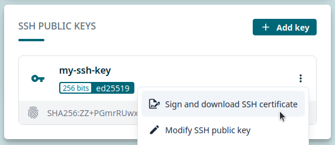

# SSH certificates

!!! danger
    To begin, make sure you have a
    [user account at CSC](https://docs.csc.fi/accounts/how-to-create-new-user-account/)
    that is a member of a project which
    [has access to the Roihu service](https://docs.csc.fi/accounts/how-to-add-service-access-for-project/)
    and perhaps [Allas](https://docs.csc.fi/data/Allas/). Note that there's a small delay
    before one can log in to Roihu after creating a new project and adding services.

!!! note
    SSH keys and certificates improve security and ease-of-use. They are required
    to be able to log in to Roihu from the terminal using an **SSH client**.

!!! warning
    SSH keys and certificates are **not** necessary if you only use the browser-based
    web interfaces to log in to Roihu.

!!! danger
    Before starting this tutorial, make sure you have [set up your SSH keys](ssh.md).

An SSH certificate is a proof of a successful two-factor authentication completed at MyCSC.
**You should never share your certificate with anyone.** Accompanied with your private SSH key,
it can grant anyone access to your account on Roihu.

## Option 1: Using the CSC certificate helper tool

!!! note
    CSC has developed a Python helper tool for signing and downloading an SSH certificate,
    and adding it to your SSH agent.

!!! tip
    This is the recommended way to get your SSH certificate for logging in to Roihu
    using an SSH client!

=== "Windows"

    1. [Download the certificate helper tool here](https://raw.githubusercontent.com/CSCfi/certificate-helper-tool/refs/heads/main/csc_cert.py)
       (right-click link and select _Save Link As..._).
    2. Check if you have Python installed on your computer:
        1. Open PowerShell or MobaXterm terminal.
        2. Type `python3` and hit `Enter`.
        3. If this opens a Python interpreter, you're good to go!
        4. If you get an error, you need to install Python. [Python downloads are available here](https://www.python.org/downloads/).
            - This may require admin privileges, so please be in contact with
              your local IT-support if necessary.
            - If Python for some reason cannot be installed on your computer,
              [please proceed with Option 2 instead](#option-2-manually-signing-and-downloading-certificate-in-mycsc).
    3. Optional, but **strongly recommended**: Make sure you have an
       **SSH authentication agent** running. There are two options:

        1. **Pageant** & **WinSCP** will enable automatic adding of SSH keys 
           and certificates to Pageant SSH agent.
            - This is recommended for users logging in to Roihu using **PuTTY** or **MobaXterm GUI**.
            - Pageant comes bundled with both PuTTY and WinSCP installations.
              [Instructions for installing WinSCP are available here](https://winscp.net/eng/docs/installation).
            - [Start Pageant following the instructions here](https://the.earth.li/~sgtatham/putty/0.83/htmldoc/Chapter9.html#pageant).
        2. `ssh-agent` utility will enable automatic adding of SSH keys
           and certificates to OpenSSH agent.
            - This is recommended for users logging in to Roihu using **PowerShell**
              or **MobaXterm terminal**.
            - [Start `ssh-agent` in PowerShell following the instructions here](https://learn.microsoft.com/en-us/windows-server/administration/openssh/openssh_keymanagement#user-key-generation)
              (requires admin privileges!).
            - Start `ssh-agent` in MobaXterm terminal by running:

                ```bash
                eval $(ssh-agent -s)
                ```

        !!! danger "Important note"
            SSH agent is not mandatory to sign and download SSH certificates for Roihu,
            but using it makes connecting much easier (e.g. no need to type SSH passphrase every time).

        !!! warning
            Using SSH agent is also a prerequisite to be able to move files directly
            between Roihu and other CSC services (like LUMI).

    4. Open PowerShell and run the certificate helper tool for example like this:

        ```powershell
        # Please change the paths and usernames (localuser, cscuser) as needed
        python3 C:\Users\localuser\Downloads\csc_cert.py -u cscuser C:\Users\localuser\.ssh\id_ed25519.pub
        ```

        1. The helper tool opens a MyCSC web page in your browser and you may be requested to authenticate.
        2. The MyCSC page displays a 6-digit code that you need to enter to the helper tool.

=== "Linux/macOS"

    1. [Download the certificate helper tool here](https://raw.githubusercontent.com/CSCfi/certificate-helper-tool/refs/heads/main/csc_cert.py)
       (right-click link and select _Save Link As..._).
    2. Check if you have Python installed on your computer:
        1. Open a terminal.
        2. Type `python3` and hit `Enter`.
        3. If this opens a Python interpreter, you're good to go!
        4. If you get an error, you need to install Python.
           [Instructions for installing Python are available here](https://wiki.python.org/moin/BeginnersGuide/Download).
            - This may require admin privileges, so please be in contact with your local IT-support if necessary.
            - If Python for some reason cannot be installed on your computer,
              [please proceed with Option 2 instead](#option-2-manually-signing-and-downloading-certificate-in-mycsc).
    3. Optional, but **strongly recommended**: Make sure you have an **SSH authentication agent** running.
       The `ssh-agent` utility will enable automatic adding of SSH keys and certificates to OpenSSH agent.

        - On Linux systems, `ssh-agent` is typically configured and enabled automatically.
        - On macOS systems, you should add the following lines to the `~/.ssh/config` file
          (create the file if it does not exist):

            ```text
            Host <host>.csc.fi
                UseKeychain no
                AddKeysToAgent yes
            ```

            Replace `<host>` with the host name. For Roihu CPU login nodes it is `roihu-cpu`.
            You can also use `roihu-*` to add the keys both for CPU and GPU login nodes, or `*` for all CSC services.

        !!! danger "Important note"
            SSH agent is not mandatory to sign and download SSH certificates for Roihu,
            but using it makes connecting much easier (e.g. no need to type SSH passphrase every time).

        !!! warning
            Using SSH agent is also a prerequisite to be able to move files directly between
            Roihu and other CSC services (like LUMI).

    4. Run the certificate helper tool for example like this:

        ```bash
        # Please change the paths and username cscuser as needed
        python3 ~/Downloads/csc_cert.py -u cscuser ~/.ssh/id_ed25519.pub
        ```

        1. The helper tool opens a MyCSC web page in your browser and you may be requested to authenticate.
        2. The MyCSC page displays a 6-digit code that you need to enter to the helper tool.

## Option 2: Manually signing and downloading certificate in MyCSC

1. Log in to [MyCSC](https://my.csc.fi) with your CSC or Haka/Virtu credentials.
2. Select _Profile_ from the left-hand navigation or the dropdown menu in the top-right corner.
3. Locate _SSH PUBLIC KEYS_ section and click the three vertical dots next to the public key you want to sign.
4. Click _Sign and download SSH certificate_. As a security measure, you may be asked to log in again.

    

5. **Recommended:** Move `cert.pub` certificate file to the same folder where you store your SSH keys
   and rename it as `<ssh private key name>-cert.pub`. For example, `id_ed25519-cert.pub`.
6. You may now log in to Roihu using an SSH client! [This is covered in the next tutorial](login.md).

## More information

- Docs CSC: More information about [connecting](https://docs.csc.fi/computing/connecting/)
  and [SSH keys and certificates](https://docs.csc.fi/computing/connecting/ssh-keys/).
