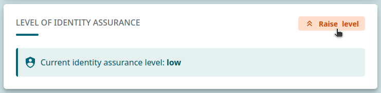
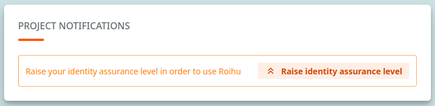

# CSC account and project

!!! abstract "In this tutorial you will learn"
    
    - How to create a CSC account and a project
    
    This document is a simplified version of
    [the accounts and projects guide in docs.csc.fi](https://docs.csc.fi/accounts/).

## Create a CSC account

:speech_balloon:
Every user needs a project and user account for using CSC services.

:speech_balloon:
For registration, you will need a mobile device that has an authentication
app for setting up multi-factor authentication (MFA).

1. Go to [MyCSC](https://my.csc.fi).
2. Click *Login* or *Create account*.
3. Click *Virtu* or *Haka* depending on which federation your home organization
   is a member of.
    - If your home organization doesn't provide Haka or Virtu, please see
      [how to contact us to register](https://docs.csc.fi/accounts/how-to-create-new-user-account/#getting-an-account-without-haka-or-virtu).
4. Select your home organization and log in to their identity service.
5. Fill in your information on the *Sign up* page.
6. You will receive an email message containing a link to MyCSC where you can
   set your CSC account password.
    - Use 12 characters or more, containing both upper and lowercase letters
      and at least one number. No special characters are allowed.
7. If you are signing up with *Virtu* you will be prompted to
   [set up your CSC MFA](https://docs.csc.fi/accounts/mfa/#how-to-activate-csc-mfa)
   after setting your CSC account password.
    - If you are signing up with Haka, you might already have a working MFA login
      integrated with your Haka login, and you will be asked to sign in with the Haka MFA.
    - If your home organisation doesn't provide Haka MFA, you will be guided to set up CSC MFA.
8. You will receive a confirmation via email after successfully registering your CSC user account.

## Check level of identity assurance and elevate if needed

:speech_balloon:
Accessing Roihu requires that every user has at least a medium
**level of identity assurance** (LoA).

1. Log in to [MyCSC](https://my.csc.fi).
2. Go to your MyCSC Profile page.
3. On the bottom right you'll find a box for *LEVEL OF IDENTITY ASSURANCE*.
4. Your current identity assurance level should be **medium** at minimum.
    1. If this is the case, everything is OK and no further actions are needed.
    2. If your LoA is **low**, please elevate it. There is a button you can click
       to start the process. A notification is also displayed on the page of your project.

        

        

    3. [More detailed instructions are available in Docs CSC](https://docs.csc.fi/accounts/strong-identification/).

## Project

:speech_balloon:
To use Roihu every account has to be a member of a project. Access to Roihu service
and computing time are tied to projects.

:point_up_tone1:
The default project called "Personal group of N.N." is **not** meant for submitting jobs!

1. Join a project
    1. via invitation link (ask the Project Manager to invite you)
    2. or by [creating a new project](https://docs.csc.fi/accounts/how-to-create-new-project/)
2. Note that there are different CSC project types:
    1. [Academic projects](https://docs.csc.fi/accounts/how-to-create-new-project/#academic)
       – The default type for academic research. Read the
       [prerequisites for and responsibilities of a project manager](https://research.csc.fi/terms-of-use/prerequisites-for-a-project-manager/).
       Reserved for [free-of-charge use cases](https://research.csc.fi/free-of-charge-use/).
    2. [Course projects](https://docs.csc.fi/accounts/how-to-create-new-project/#course)
       – Designed for delivering a course using CSC services once. Fixed time and resources.
       Reserved for [free-of-charge use cases](https://research.csc.fi/free-of-charge-use/).
    3. [Student projects](https://docs.csc.fi/accounts/how-to-create-new-project/#student)
       – Designed to support students' work with courses and thesis work. Fixed time and resources.
       Reserved for [free-of-charge use cases](https://research.csc.fi/free-of-charge-use/).
       Read more about [getting started with student projects](https://docs.csc.fi/support/tutorials/student_quick/).
    4. [LUMI](https://docs.csc.fi/accounts/how-to-create-new-project/#how-to-create-finnish-lumi-projects)
       – Projects restricted to LUMI environment. Fixed time and resources. Read the
       [prerequisites for and responsibilities of a project manager](https://research.csc.fi/terms-of-use/prerequisites-for-a-project-manager/).
    5. Commercial – Reserved for projects outside of CSC's free-of-charge use policy.
       Only available through [CSC Service Desk](https://docs.csc.fi/support/contact/).

:bulb:
A summary of CSC project types you are entitled to create based on your Haka affiliation
is available in
[Docs CSC](https://docs.csc.fi/accounts/how-to-create-new-project/#right-to-create-csc-projects-based-on-haka-affiliation).

## Add services to your project

:bulb:
The Project Manager
[must have applied for the services](https://docs.csc.fi/accounts/how-to-add-service-access-for-project/#project-manager)
for the project first. Here, you accept the _Terms of Use_ and activate them.

1. Log in to [MyCSC](https://my.csc.fi)
2. Click _Projects_ and select a project
3. In the bottom right corner you see the _Services_ section. Click the _Add services_ button there.
4. Select **Roihu** and **Allas**, approve the terms of use and click _Add selected services_

## More information

- [Docs: User account at CSC](https://docs.csc.fi/accounts/how-to-create-new-user-account/)
- [Docs: Project access to CSC services](https://docs.csc.fi/accounts/how-to-add-service-access-for-project/)
- [Research: Project Manager](https://research.csc.fi/terms-of-use/prerequisites-for-a-project-manager)
